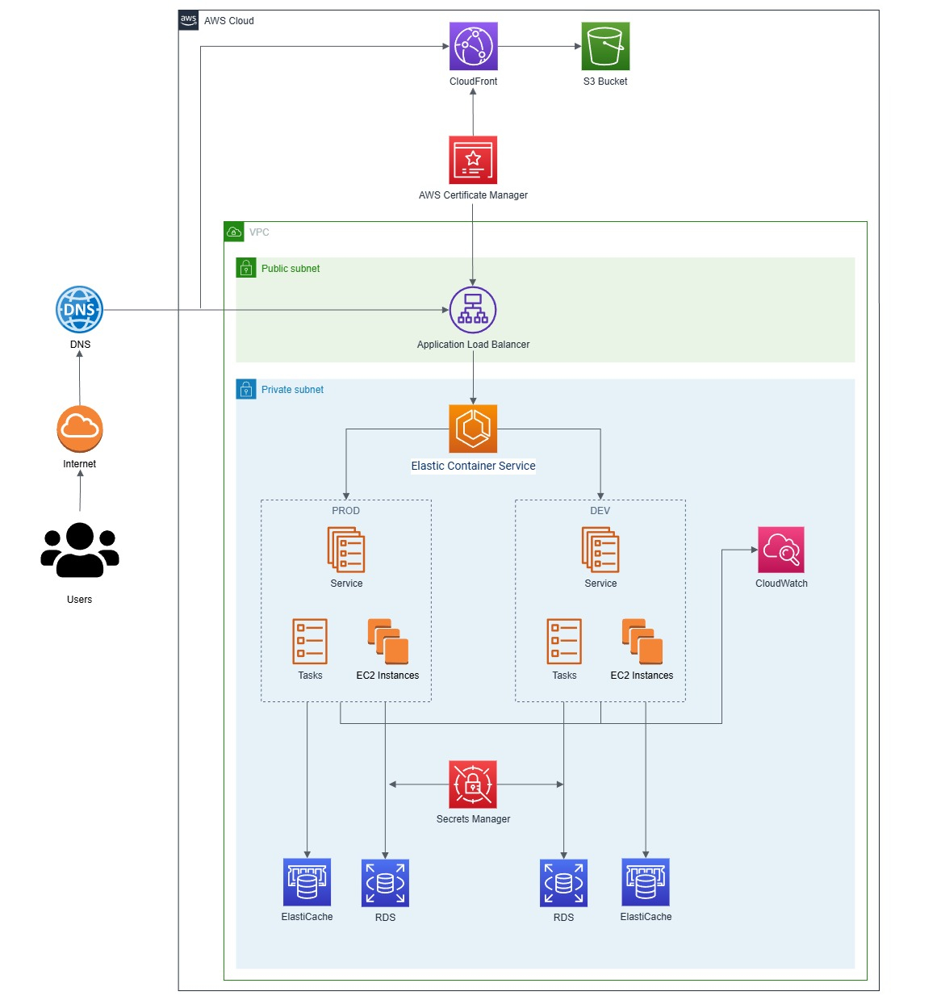
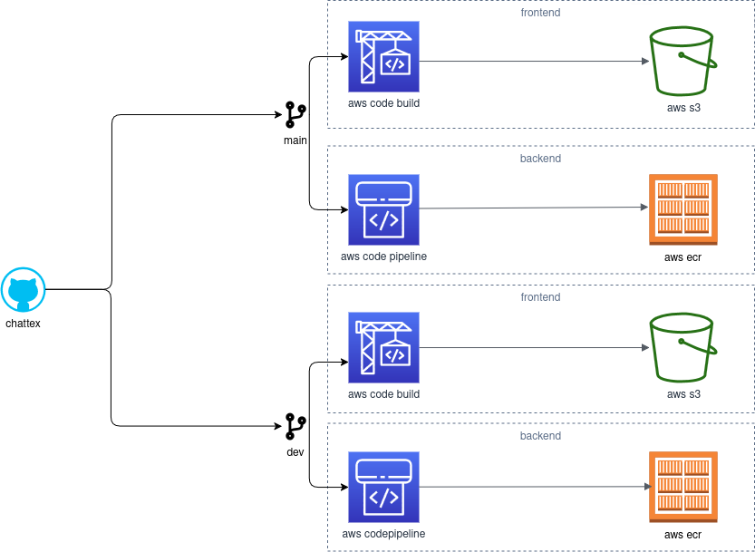

# CHATTEX - CHATTUJ DO WOLI 💬

[](https://github.com/niechcemisietegorobic/CHATTEX/actions/workflows/codeql.yml)


CHATTEX to webowa aplikacja **czat + forum**, stworzona jako projekt zespołowy
z przedmiotu **Bezpieczeństwo serwerów i aplikacji Web** na kierunku Cyberbezpieczeństwo.

Aplikacja umożliwia:
- personalizacje wyglądu
- korzystanie z publicznego czatu
- pisanie prywatnych wiadomości (DM)
- publikowanie i komentowanie postów na forum

---

## Architektura aplikacji

Aplikacja składa się z dwóch głównych komponentów:

### Backend
- Python + Flask, REST API, JWT (autoryzacja)

Katalog:
```
backend/
```

### Frontend
- Vue js, REST API

Katalog:
```
frontend/
```

---

## Uruchamianie aplikacji

W celu poprawnego funkcjonowania aplikacji konieczne jest skonfigurowanie sekretów i zmiennych środowiskowych:

### backend

| Typ  | Nazwa | Opis | 
| ------------- | ------------- | ------------- | 
| Sekret | \<branch\>/chattex/django_secret_key  | sekret używany przez django  |
| Sekret  | \<branch\>/chattex/root_invite  | pierwsze zaproszenie służące do rejestracji na platformie  |
| Zmienna  | IS_DEV  | czy kontener działa w wersji dev  |
| Zmienna  | RDS_URL  | adres bazy PostgreSQL  |
| Zmienna  | CACHE_URL  | adres ElastiCache  |
| Zmienna  | RDS_SM  | nazwa sekretu przechowującego dane logowania RDS  |
| Zmienna  | FRONTEND_URL  | adres origin z którego będą wysyłane requesty API  |
| Zmienna  | MEDIA_BUCKET  | nazwa wiaderka S3 przechowującego media przesłane przez użytkowników  |
| Zmienna  | MEDIA_URL  | adres url z którego udostępniane są media  |
| Zmienna  | REGION  | region w którym uruchomiona jest infrastruktura  |

### frontend

| Typ  | Nazwa | Opis | 
| ------------- | ------------- | ------------- | 
| Parametr  | /CHATTEX_\<branch\>/API_URL  | adres url api https |
| Parametr  | /CHATTEX_\<branch\>/WEBSOCKET_API_URL  | adres url api wss  |

---

## ☁️ Architektura chmurowa (AWS)

### Schemat infrastruktury



### Schemat CI/CD



---

